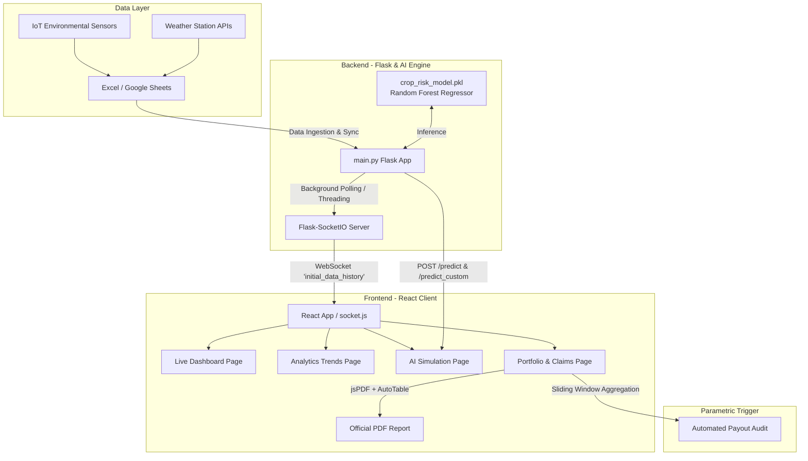

# 🌾 AgriShield — AI-Powered Parametric Crop Insurance & Telemetry Intelligence

[](https://www.python.org/)
[](https://flask.palletsprojects.com/)
[](https://react.dev/)
[](https://scikit-learn.org/)
[](https://socket.io/)
[](https://tailwindcss.com/)
[](LICENSE)

> **AgriShield** is a next-generation **Parametric Crop Insurance & Agricultural Risk Intelligence Platform**. By combining real-time IoT environmental telemetry (temperature, soil moisture, humidity, rainfall) with a multi-output Machine Learning core, AgriShield automates risk assessment and triggers instantaneous, tamper-free insurance payouts without subjective adjusters or weeks of claim delays.

---

## 📌 Table of Contents
- [Executive Overview](#-executive-overview)
- [Why Parametric Insurance?](#-why-parametric-insurance)
- [Core Features](#-core-features)
- [System Architecture](#-system-architecture)
- [Machine Learning & Parametric Trigger Logic](#-machine-learning--parametric-trigger-logic)
- [Project Directory Structure](#-project-directory-structure)
- [Quick Start & Installation](#-quick-start--installation)
  - [Prerequisites](#prerequisites)
  - [1. Backend Setup](#1-backend-setup)
  - [2. Model Training (Optional/Verification)](#2-model-training-optionalverification)
  - [3. Frontend Setup](#3-frontend-setup)
- [API & WebSocket Reference](#-api--websocket-reference)
- [Platform Walkthrough](#-platform-walkthrough)
- [Future Roadmap](#-future-roadmap)
- [Contributing & License](#-contributing--license)

---

## 🚀 Executive Overview

Traditional agricultural insurance suffers from **severe systemic friction**:
- **Manual Assessment Delays**: Claims require physical field adjusters, taking weeks or months while farmers remain in distress.
- **Moral Hazard & Dispute Friction**: Disagreements over yield loss metrics, subjectivity, and fraudulent filings.
- **High Administrative Overhead**: Operations consume up to 30–40% of insurance premiums.

**AgriShield solves this through automated parametric triggers:**
1. **Continuous Telemetry Ingestion**: Captures soil moisture, ambient temperature, air humidity, and rainfall via field IoT sensors or connected spreadsheets.
2. **AI-Driven Risk Modeling**: Evaluates stress factors using a Multi-Output Random Forest Regressor trained on non-linear crop thresholds and extreme weather events.
3. **Instantaneous Parametric Payouts**: Automatically calculates entitlement percentages based on verified threshold breaches, providing instant financial liquidity to farmers.

---

## 💡 Why Parametric Insurance?

| Feature | Traditional Indemnity Insurance | AgriShield Parametric Model |
| :--- | :--- | :--- |
| **Trigger Mechanism** | Assessed physical crop damage | Pre-defined objective sensor telemetry breach |
| **Claim Settlement Time** | 30 to 90+ days | **Instantaneous (Real-time telemetry validation)** |
| **Claim Process** | Complex paperwork, site inspector visit | **Zero paperwork, zero human friction** |
| **Transparency** | Low (Opaque insurer evaluation) | **100% Transparent, auditable ground-truth metrics** |
| **Operational Costs** | High (Field visits, legal processing) | **Near-zero marginal cost per claim** |

---

## ✨ Core Features

### 1. 🛰️ Real-Time Telemetry & WebSocket Ingestion
- Live streaming from Excel / Google Sheets / IoT sensor gateways.
- Socket.IO duplex event channels ensuring zero-latency updates to the client dashboard.
- Background worker monitoring and broadcasting telemetry deltas automatically.

### 2. 🧠 Multi-Output AI Risk Prediction Engine
- Trained `RandomForestRegressor` predicting both **Risk Score (0–100%)** and **Payout Entitlement (0–100%)**.
- Evaluates individual stress metrics using agricultural boundary logic (Safe Zone vs. Danger Zone).
- Pinpoints the **Primary Risk Driver** (e.g., Extreme Heat, Soil Desiccation, Flood Inundation).

### 3. 📊 High-Performance Live Dashboard
- Real-time gauge metrics:
  - **Risk Score** (Low, Moderate, High, Critical)
  - **Crop Health Index** (Dynamic inverse scale)
  - **Eligible Payout Percentage**
  - **Live Sensor Telemetry** (Temperature, Soil Moisture, Air Humidity, Precipitation)
- Active Warning Banner notifying of active payout triggers and extreme climate events.

### 4. 📈 Interactive Analytics Suite
- Built with **Recharts**:
  - Temperature vs. Crop Risk correlation graphs.
  - Soil Moisture & Humidity dynamics.
  - Historical temporal risk trends across recording cycles.

### 5. 🧪 What-If Scenario & Regional Climate Simulator
- Interactive parameter sliders to test stress conditions:
  - Temperature (-10°C to 60°C)
  - Soil Moisture (0% to 100%)
  - Relative Humidity (0% to 100%)
  - Rainfall (0mm to 100mm)
- **Regional Threshold Customizer**: Adapt safe/danger envelopes for specific crops (e.g., arid millets vs. water-intensive paddy rice).

### 6. 💼 Portfolio Auditing & PDF Reporting
- Insurer-grade portfolio management table with audit trails.
- **Sliding-Window Payout Algorithm**: Aggregates sustained stress intervals across configurable historical periods.
- **Client-Side Export**: Generates official branded **AgriShield Parametric Insurance PDF Reports** via `jsPDF` and `jspdf-autotable`.

---

## 🏗️ System Architecture



---

## 🧮 Machine Learning & Parametric Trigger Logic

### 1. Environmental Thresholds (Ground Truth)

The model evaluates four key crop stressors based on physiological safe zones:

| Factor | Safe Range | Danger Threshold | Lethal Stress Indicator |
| :--- | :--- | :--- | :--- |
| **Temperature** | 18°C – 35°C | < 5°C or > 50°C | Extreme heat wave / Frost freeze |
| **Soil Moisture** | 40% – 80% | < 20% or > 95% | Severe drought / Waterlogged roots |
| **Air Humidity** | < 75% | > 95% | Fungal / Blight pathogen surge |
| **Rainfall** | < 30 mm | > 60 mm | Flash flooding / Topsoil erosion |

### 2. Max Factor Principle
Crop loss is non-compensatory; optimal rainfall does not rescue a crop burned by 52°C heat. Hence:
$$\text{Total Risk} = \max(R_{\text{temp}}, R_{\text{moisture}}, R_{\text{humidity}}, R_{\text{rainfall}})$$

### 3. Parametric Payout Curve
- **$\text{Risk} \le 40\%$**: $0\%$ Payout (Within normal farm management resilience).
- **$40\% < \text{Risk} < 90\%$**: Linear proportional payout scaled between 0% and 100%:
  $$\text{Payout \%} = \frac{\text{Risk} - 40}{90 - 40} \times 100$$
- **$\text{Risk} \ge 90\%$**: $100\%$ Full Payout (Catastrophic total crop loss).

---

## 📁 Project Directory Structure

```text
AgriShield/
│
├── AgriShield_Presentation.pptx   # Official pitch presentation
├── indian_farmer.png              # Platform media asset
├── newspaper_farmer.png           # Platform media asset
├── README.md                      # Comprehensive project documentation
├── .gitignore                     # Git ignore rules (Node, Python, build artifacts)
│
├── backend/                       # Flask & AI Inference Service
│   ├── crop_risk_model.pkl        # Serialized Multi-Output Random Forest model
│   ├── main.py                    # Flask server, WebSocket handler, and REST APIs
│   ├── model.py                   # Legacy / fallback risk calculation routines
│   └── train_model.py             # Synthetic data generation and model training script
│
├── data_science/                  # Model Exploration & Datasets
│   ├── crop_risk_model.pkl        # Backup serialized model
│   ├── sensors.xlsx               # Local sensor telemetry dataset
│   ├── setup_excel.py             # Spreadsheet generator for local sensor simulation
│   ├── train_model.ipynb          # Jupyter notebook for EDA and model evaluation
│   └── train_model.py             # Data science training pipeline
│
└── frontend/                      # React 19 Single Page Application
    ├── public/
    │   ├── index.html             # HTML entry point
    │   └── logo.png               # AgriShield brand logo
    ├── src/
    │   ├── pages/
    │   │   ├── Dashboard.js       # Live KPI cards, gauge telemetry & alert banner
    │   │   ├── Analytics.js       # Recharts trend analytics (Risk vs Temp, Moisture)
    │   │   ├── AIPrediction.js    # Standard & Regional What-If Simulation sandbox
    │   │   └── Portfolio.js       # Historical records, sliding-window payouts & PDF export
    │   ├── App.js                 # Layout, navigation sidebar, and WebSocket listener
    │   ├── socket.js              # Socket.IO client configuration
    │   ├── index.css              # Global styles & Tailwind CSS directives
    │   └── index.js               # React DOM bootstrap
    └── package.json               # Frontend dependencies & scripts
```

---

## ⚡ Quick Start & Installation

### Prerequisites
- **Node.js**: v18.x or v20.x ([Download](https://nodejs.org/))
- **Python**: v3.9+ ([Download](https://www.python.org/))
- **Git**: Installed and configured

---

### 1. Backend Setup

1. Open a terminal and navigate to the project directory:
   ```bash
   cd AgriShield/backend
   ```

2. Create and activate a Python virtual environment:
   ```bash
   # Windows (PowerShell):
   python -m venv .venv
   .\.venv\Scripts\Activate.ps1

   # macOS / Linux:
   python3 -m venv .venv
   source .venv/bin/activate
   ```

3. Install required Python packages:
   ```bash
   pip install flask flask-cors flask-socketio pandas numpy scikit-learn joblib openpyxl requests
   ```

4. Run the Flask backend server:
   ```bash
   python main.py
   ```
   *The backend will boot up on `http://localhost:5000` and start broadcasting WebSocket updates.*

---

### 2. Model Training (Optional / Verification)

If you ever wish to re-train the Random Forest model on updated parameter envelopes:
```bash
python backend/train_model.py
```
This regenerates `crop_risk_model.pkl` with 5,000 synthetic multi-variate observations using the agricultural ground truth logic.

---

### 3. Frontend Setup

1. Open a second terminal and navigate to the `frontend` directory:
   ```bash
   cd AgriShield/frontend
   ```

2. Install dependencies:
   ```bash
   npm install
   ```

3. Launch the development server:
   ```bash
   npm start
   ```
   *The React application will open automatically at `http://localhost:3000`.*

---

## 🔌 API & WebSocket Reference

### REST Endpoints

#### 1. Standard AI Inference
- **Endpoint**: `POST /predict`
- **Headers**: `Content-Type: application/json`
- **Request Body**:
  ```json
  {
    "temperature": 38.5,
    "soilMoisture": 22.0,
    "humidity": 65.0,
    "rainfall": 2.0
  }
  ```
- **Response**:
  ```json
  {
    "risk_score": 90.0,
    "payout_pct": 100.0,
    "primary_driver": "Temperature"
  }
  ```

#### 2. Regional Customized Prediction
- **Endpoint**: `POST /predict_custom`
- **Request Body**:
  ```json
  {
    "temperature": 42.0,
    "soilMoisture": 18.0,
    "humidity": 40.0,
    "rainfall": 0.0,
    "thresholds": {
      "tSafeMin": 15, "tSafeMax": 32, "tDangerMin": 4, "tDangerMax": 45,
      "mSafeMin": 45, "mSafeMax": 85, "mDangerMin": 15, "mDangerMax": 95,
      "hSafeMax": 70, "hDangerMax": 90,
      "rSafeMax": 25, "rDangerMax": 50
    }
  }
  ```
- **Response**:
  ```json
  {
    "risk_score": 92.31,
    "payout_pct": 100.0,
    "primary_driver": "Regional Override"
  }
  ```

### WebSocket Events (`Socket.IO`)

| Event Name | Direction | Payload | Description |
| :--- | :--- | :--- | :--- |
| `connect` | Client $\rightarrow$ Server | None | Client initiates real-time connection. |
| `request_sync` | Client $\rightarrow$ Server | None | Requests immediate full dataset broadcast. |
| `initial_data_history` | Server $\rightarrow$ Client | `Array<TelemetryRecord>` | Pushes audited records with risk scores, health scores, and payouts. |

---

## 🖥️ Platform Walkthrough

| View | Purpose & Functionality |
| :--- | :--- |
| **Dashboard** | Displays active crop health metrics, live environmental readings, real-time risk index, and instant alert status. |
| **Analytics** | Comparative charts correlating temperature, soil moisture, and atmospheric humidity with historical crop risk trends. |
| **AI Prediction** | Sandbox simulation tool allowing users and agronomists to tweak variables or regional boundaries and observe predicted payouts. |
| **Portfolio** | Full historical telemetry audit, sliding-window claims evaluation, and instant PDF claim documentation. |

---

## 🔮 Future Roadmap

- [ ] **Decentralized Escrow / Smart Contracts**: Integrate Polygon / Ethereum smart contracts to execute programmatic wallet payouts upon trigger verification.
- [ ] **Satellite Imagery & NDVI Fusion**: Corroborate ground IoT sensor data with Sentinel-2 / Landsat NDVI (Normalized Difference Vegetation Index) feeds.
- [ ] **Crop-Specific Preset Profiles**: Out-of-the-box parameter profiles for Wheat, Basmati Rice, Cotton, Sugarcane, and Mustard.
- [ ] **SMS / WhatsApp Farmer Alerts**: Integration with Twilio for direct SMS advisories in regional vernacular languages (Hindi, Punjabi, Marathi, Telugu).

---

## 📄 License & Contributing

- **License**: Distributed under the MIT License. See `LICENSE` for more information.
- **Contributions**: Contributions, issues, and feature requests are welcome! Feel free to fork the repository and submit a Pull Request.

---

<div align="center">
  <sub>Built with ❤️ for resilient, climate-smart agriculture.</sub>
</div>
